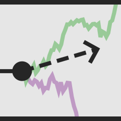

<!--lint ignore first-heading-level-->

<header class="dec-index-header">
  
  <hgroup class="dec-index-titles">
    <h1 class="dec-index-title">
      accumulable
    </h1>
    
An Explorable Explanation of the Diffusion Decision Model

  </hgroup>
  

    <rdk-2afc-task running count="120" coherence="0.25" trials="1" probability="0.5" duration="Infinity" wait="0" iti="0"></rdk-2afc-task>
  

  

    What determines the reaction time and accuracy of our perceptual decisions? The Diffusion Decision Model proposes a mathematical explanation in terms of evidence accumulation.
  

  

    You can explore the Diffusion Decision Model in the following pages, so jump on in!
  

</header>
