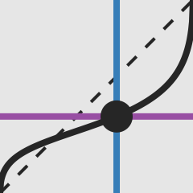

<!--lint ignore first-heading-level-->

<header class="dec-index-header">
  
  <hgroup class="dec-index-titles">
    <h1 class="dec-index-title">
      diskountable
    </h1>
    
An Explorable Explanation of Hyperbolic Temporal Discounting

  </hgroup>
  

    <itc-task running trials="Infinity" duration="4000" iti="1000"></itc-task>
  

  

    How do we decide between smaller rewards sooner and larger rewards later? 
    Hyperbolic Temporal Discounting provides a mathematical description of this tradeoff.
  

  

    You can explore Hyperbolic Temporal Discounting in the following pages, so jump on in!
  

</header>
