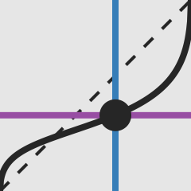

<!--lint ignore first-heading-level-->

<header class="dec-index-header">
  
  <hgroup class="dec-index-titles">
    <h1 class="dec-index-title">
      prospectαbλe
    </h1>
    
An Explorable Explanation of Cumulative Prospect Theory

  </hgroup>
  

    <risky-task running trials="Infinity" duration="3000" iti="500"></risky-task>
  

  

    How do we decide between risky options? 
    Cumulative Prospect Theory describes mathematical transformations of objective probabilities and
    values into <em>decision weights</em> and <em>subjective values</em> which we combine on a
    relative scale.
  

  

    You can explore Cumulative Prospect Theory in the following pages, so jump on in!
  

</header>
